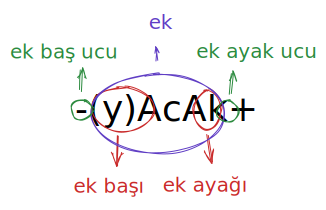

# Ekler



<table><thead><tr><th>Ek</th><th data-type="select">Tür</th><th data-type="select" data-multiple>Alt Tür</th><th data-type="select" data-multiple>Taban</th><th data-hidden>Açıklama</th></tr></thead><tbody><tr><td><a data-mention href="ekler/cekim-ekleri/adlik-cekim-ekleri/+lar-+lar-+ler.md">+lar-+lar-+ler.md</a>(<mark style="color:green;">+lar~</mark>, <mark style="color:green;">+ler~</mark>)</td><td></td><td></td><td></td><td><mark style="color:blue;"></mark></td></tr><tr><td><a data-mention href="ekler/yapim-ekleri/addan-ad-yapan-yapim-ekleri/+-i-msak+.md">+-i-msak+.md</a>(<mark style="color:green;">+msak+</mark>, <mark style="color:green;">+msek+</mark>, <mark style="color:green;">+ımsak+</mark>, <mark style="color:green;">+imsek+</mark>)</td><td></td><td></td><td></td><td><mark style="color:blue;"></mark></td></tr><tr><td><a data-mention href="ekler/yapim-ekleri/addan-ad-yapan-yapim-ekleri/+-x-k+.md">+-x-k+.md</a>(<mark style="color:green;">+k+</mark>, <mark style="color:green;">+ık+</mark>, <mark style="color:green;">+ik+</mark>, <mark style="color:green;">+uk+</mark>, <mark style="color:green;">+ük+</mark>)</td><td></td><td></td><td></td><td><mark style="color:blue;"></mark></td></tr><tr><td><a data-mention href="ekler/yapim-ekleri/eylemden-eylem-yapan-yapim-ekleri/ala.md">ala.md</a>(<mark style="color:green;">-ala-</mark>, <mark style="color:green;">-ele-</mark>)</td><td></td><td></td><td></td><td><mark style="color:blue;"></mark></td></tr><tr><td><a data-mention href="ekler/yapim-ekleri/eylemden-ad-yapan-yapim-ekleri/x+.md">x+.md</a>(<mark style="color:green;">-ı+</mark>, <mark style="color:green;">-i+</mark>, <mark style="color:green;">-u+</mark>, <mark style="color:green;">-ü+</mark>)</td><td></td><td></td><td></td><td><mark style="color:blue;"></mark></td></tr></tbody></table>

&#x20;[+lar-+lar-+ler.md](ekler/cekim-ekleri/adlik-cekim-ekleri/+lar-+lar-+ler.md "mention")(<mark style="color:green;">+lar\~</mark>, <mark style="color:green;">+ler\~</mark>){ <mark style="color:red;background-color:red;">Adlık Çekim Eki</mark> : <mark style="color:purple;background-color:purple;">Çokluk eki</mark> }



<table><thead><tr><th>Ek</th><th data-type="select" data-multiple>Alt Tür</th><th data-type="select" data-multiple>Taban</th><th data-hidden data-type="select">Tür</th><th data-hidden>Açıklama</th></tr></thead><tbody><tr><td><a data-mention href="ekler/cekim-ekleri/adlik-cekim-ekleri/+lar-+lar-+ler.md">+lar-+lar-+ler.md</a>(<mark style="color:green;">+lar~</mark>, <mark style="color:green;">+ler~</mark>)</td><td></td><td></td><td></td><td><mark style="color:blue;"></mark></td></tr></tbody></table>



<table><thead><tr><th>Ek</th><th data-type="select" data-multiple>Alt Tür</th><th data-type="select" data-multiple>Taban</th><th data-hidden data-type="select">Tür</th><th data-hidden>Açıklama</th></tr></thead><tbody><tr><td><a data-mention href="ekler/yapim-ekleri/addan-ad-yapan-yapim-ekleri/+-i-msak+.md">+-i-msak+.md</a>(<mark style="color:green;">+msak+</mark>, <mark style="color:green;">+msek+</mark>, <mark style="color:green;">+ımsak+</mark>, <mark style="color:green;">+imsek+</mark>)</td><td></td><td></td><td></td><td><mark style="color:blue;"></mark></td></tr><tr><td><a data-mention href="ekler/yapim-ekleri/addan-ad-yapan-yapim-ekleri/+-x-k+.md">+-x-k+.md</a>(<mark style="color:green;">+k+</mark>, <mark style="color:green;">+ık+</mark>, <mark style="color:green;">+ik+</mark>, <mark style="color:green;">+uk+</mark>, <mark style="color:green;">+ük+</mark>)</td><td></td><td></td><td></td><td><mark style="color:blue;"></mark></td></tr><tr><td><a data-mention href="ekler/yapim-ekleri/eylemden-eylem-yapan-yapim-ekleri/ala.md">ala.md</a>(<mark style="color:green;">-ala-</mark>, <mark style="color:green;">-ele-</mark>)</td><td></td><td></td><td></td><td><mark style="color:blue;"></mark></td></tr><tr><td><a data-mention href="ekler/yapim-ekleri/eylemden-ad-yapan-yapim-ekleri/x+.md">x+.md</a>(<mark style="color:green;">-ı+</mark>, <mark style="color:green;">-i+</mark>, <mark style="color:green;">-u+</mark>, <mark style="color:green;">-ü+</mark>)</td><td></td><td></td><td></td><td><mark style="color:blue;"></mark></td></tr></tbody></table>



YAKINDA!

Ad türleri, edim türleri ve öbür sözcük türleri ile ilgili bilgileri burada bulacaksınız.



## <mark style="color:purple;">🦉</mark> <mark style="color:orange;">Bilmelisiniz</mark>

<mark style="color:orange;">Bu sekmelerde ve dizmelerde, ekleri bir arada görebileceğiniz gibi küme küme olarak görebilirsiniz. Aşağıda bilmeyenlerin daha bilinçli olması amacı ile bir dizi bilgiler ve kurallar yazılmıştır.</mark>

## Türetme Ekleri & Çekim Ekleri

Türkçede ekler iki ana kümede derlenir. Birisi türetme ekleri, birisi çekim ekleri. Bu ekler yazıda gösterilmek istenir ise şöyle gösterilir: <mark style="color:red;">-</mark><mark style="color:purple;">ek</mark><mark style="color:red;">-</mark>, <mark style="color:red;">+</mark><mark style="color:purple;">ek</mark><mark style="color:red;">-</mark>, <mark style="color:red;">-</mark><mark style="color:purple;">ek</mark><mark style="color:red;">+</mark>, <mark style="color:red;">+</mark><mark style="color:purple;">ek</mark><mark style="color:red;">+</mark>, <mark style="color:red;">-</mark><mark style="color:purple;">ek</mark><mark style="color:red;">\~</mark>, <mark style="color:red;">+</mark><mark style="color:purple;">ek</mark><mark style="color:red;">\~</mark>, <mark style="color:red;">\~</mark><mark style="color:purple;">ek</mark><mark style="color:red;">\~</mark>

## 📜 Ek Yazım Kuralları

#### <mark style="color:purple;">Ek</mark> başındaki <mark style="color:green;background-color:green;"></mark> <mark style="color:green;background-color:green;"></mark><mark style="color:green;background-color:green;">**-**</mark> <mark style="color:green;background-color:green;"></mark><mark style="color:green;background-color:green;"></mark> damgası, _<mark style="color:red;">edim ayağına</mark>_ ekleneceğini anlatır.&#x20;

<mark style="color:purple;">sözcük</mark><mark style="color:red;">**-**</mark><mark style="color:purple;">**(A)k**</mark><mark style="color:red;">**+**</mark>, <mark style="color:purple;">sözcük</mark><mark style="color:red;">**-**</mark><mark style="color:purple;">**AlA**</mark><mark style="color:red;">**-**</mark>, <mark style="color:purple;">sözcük</mark><mark style="color:red;">**-**</mark><mark style="color:purple;">**AcAk**</mark><mark style="color:red;">**\~**</mark>, gibi gibi...

> "Dergiye yazacak!" = \[Dergi+(y)A\~ yaz-AcAk\~]\(Dergi+ye\~ yaz-acak\~!)
>
> "Bıçak kesecek!" = \[Bıç-(A)k+ kes-AcAk\~!]\(Bıç-ak+ kes-ecek\~!)

#### <mark style="color:purple;">Ek</mark> başındaki <mark style="background-color:green;"></mark> <mark style="color:green;background-color:green;">**+**</mark> <mark style="background-color:green;"></mark> damgası, _<mark style="color:blue;">ad ayağına</mark>_ ekleneceğini anlatır.&#x20;

<mark style="color:purple;">sözcük</mark><mark style="color:red;">**+**</mark><mark style="color:purple;">**lXk**</mark><mark style="color:red;">**+**</mark>, <mark style="color:purple;">sözcük</mark><mark style="color:red;">**+**</mark><mark style="color:purple;">**lA**</mark><mark style="color:red;">**-**</mark>, <mark style="color:purple;">sözcük</mark><mark style="color:red;">**+**</mark><mark style="color:purple;">**(y)A**</mark><mark style="color:red;">**\~**</mark>, gibi gibi...

#### <mark style="color:purple;">Ek</mark> başındaki <mark style="background-color:green;"></mark> <mark style="color:green;background-color:green;">**\~**</mark> <mark style="background-color:green;"></mark> damgası, _<mark style="color:orange;">çekim eki ayağına</mark>_ ekleneceğini anlatır.

<mark style="color:purple;">sözcük</mark><mark style="color:red;">**\~**</mark><mark style="color:purple;">**X**</mark><mark style="color:red;">**\~**</mark>, <mark style="color:red;"></mark> <mark style="color:purple;">sözcük</mark><mark style="color:red;">**\~**</mark><mark style="color:purple;">**(y)A**</mark><mark style="color:red;">**\~**</mark>, gibi gibi...

#### <mark style="color:purple;">Ek</mark> ayağındaki <mark style="color:green;background-color:green;"></mark> <mark style="color:green;background-color:green;"></mark><mark style="color:green;background-color:green;">**-**</mark> <mark style="color:green;background-color:green;"></mark><mark style="color:green;background-color:green;"></mark> damgası, <mark style="color:red;">edim</mark> <mark style="color:green;">türetme eki</mark> olduğunu anlatır.&#x20;

<mark style="color:purple;">sözcük</mark><mark style="color:red;">**+**</mark><mark style="color:purple;">**lA**</mark><mark style="color:red;">**-**</mark>, <mark style="color:purple;">sözcük</mark><mark style="color:red;">**-**</mark><mark style="color:purple;">**AlA**</mark><mark style="color:red;">**-**</mark>, gibi gibi...

#### <mark style="color:purple;">Ek</mark> ayağındaki <mark style="background-color:green;"></mark> <mark style="color:green;background-color:green;">**+**</mark> <mark style="background-color:green;"></mark> damgası, <mark style="color:blue;">ad</mark> <mark style="color:green;">türetme eki</mark> olduğunu anlatır.&#x20;

<mark style="color:purple;">sözcük</mark><mark style="color:red;">**+**</mark><mark style="color:purple;">**lXk**</mark><mark style="color:red;">**+**</mark>, <mark style="color:purple;">sözcük</mark><mark style="color:red;">**-**</mark><mark style="color:purple;">**Ak**</mark><mark style="color:red;">**+**</mark>, gibi gibi...

#### <mark style="color:purple;">Ek</mark> ayağındaki <mark style="background-color:green;"></mark> <mark style="color:green;background-color:green;">**\~**</mark> <mark style="background-color:green;"></mark> damgası, <mark style="color:orange;">çekim eki</mark> olduğunu anlatır.&#x20;

<mark style="color:purple;">sözcük</mark><mark style="color:red;">**+**</mark><mark style="color:purple;">**(y)A**</mark><mark style="color:red;">**\~**</mark>, <mark style="color:purple;">sözcük</mark><mark style="color:red;">**-**</mark><mark style="color:purple;">**AcAk**</mark><mark style="color:red;">**\~**</mark>, <mark style="color:red;"></mark> <mark style="color:purple;">sözcük</mark><mark style="color:red;">**\~**</mark><mark style="color:purple;">**X**</mark><mark style="color:red;">**\~**</mark>, gibi gibi...

#### <mark style="color:purple;">Ek</mark> başındaki <mark style="background-color:green;"></mark> <mark style="color:green;background-color:green;">⊖</mark> <mark style="background-color:green;"></mark> damgası, _<mark style="color:red;">edim ayağına</mark>_ ekleneceğini, ardından gelen eklerin ayrı ayrı belirtilmeyeceğini anlatır.

<mark style="color:purple;">sözcük</mark><mark style="color:red;">**⊖**</mark><mark style="color:purple;">**(y)AcAksXn**</mark><mark style="color:red;">**\~**</mark>, <mark style="color:red;"></mark> <mark style="color:purple;">sözcük</mark><mark style="color:red;">**⊖**</mark><mark style="color:purple;">**mACXlXk**</mark><mark style="color:red;">**+**</mark>, gibi gibi...

#### <mark style="color:purple;">Ek</mark> başındaki <mark style="background-color:green;"></mark> <mark style="color:green;background-color:green;">⨁</mark> <mark style="background-color:green;"></mark> damgası, _<mark style="color:blue;">ad ayağına</mark>_ ekleneceğini, ardından gelen eklerin ayrı ayrı belirtilmeyeceğini anlatır.

<mark style="color:purple;">sözcük</mark><mark style="color:red;">**⨁**</mark><mark style="color:purple;">**X(y)AcAksXnXz**</mark><mark style="color:red;">**\~**</mark>, <mark style="color:red;"></mark> <mark style="color:purple;">sözcük</mark><mark style="color:red;">**⨁**</mark><mark style="color:purple;">**CXlXk**</mark><mark style="color:red;">**+**</mark>, gibi gibi..

#### <mark style="color:purple;">Ek</mark>teki <mark style="color:purple;background-color:purple;">A</mark> damgası, önceki ünlüye göre a, e harflerinden biri olacağını anlatır.

<mark style="color:purple;">sözcük</mark><mark style="color:red;">**+**</mark><mark style="color:purple;">**(y)A**</mark><mark style="color:red;">**\~**</mark><mark style="color:green;">(+a\~, +e\~, +ya\~, +ye\~)</mark> gibi gibi...

#### <mark style="color:purple;">Ek</mark>teki <mark style="color:purple;background-color:purple;">I</mark> damgası, ekten önceki ünlüye göre ı, i harflerinden biri olacağını anlatır.

#### <mark style="color:purple;">Ek</mark>teki <mark style="color:purple;background-color:purple;">U</mark> damgası, ekten önceki ünlüye göre u, ü harflerinden biri olacağını anlatır.

#### <mark style="color:purple;">Ek</mark>teki <mark style="color:purple;background-color:purple;">O</mark> damgası, ekten önceki ünlüye göre o, ö harflerinden biri olacağını anlatır.

#### <mark style="color:purple;">Ek</mark>teki <mark style="color:purple;background-color:purple;">X</mark> damgası, ekten önceki ünlüye göre ı, i, u, ü harflerinden biri olacağını anlatır.

<mark style="color:purple;">sözcük</mark><mark style="color:red;">**+**</mark><mark style="color:purple;">**(y)X**</mark><mark style="color:red;">**\~**</mark><mark style="color:green;">(+ı\~, +i\~, +u\~, +ü\~, +yı\~, +yi\~, +yu\~, +yü\~)</mark> gibi gibi...

<mark style="color:purple;"></mark>

<mark style="color:purple;">Ek</mark>teki <mark style="color:purple;background-color:purple;">C</mark> damgası, önceki ünsüze göre c, ç harflerinden biri olacağını anlatır.

<mark style="color:purple;">Ek</mark>teki <mark style="color:purple;background-color:purple;">D</mark> damgası, ekten önceki ünsüze göre d, t harflerinden biri olacağını anlatır.

<mark style="color:purple;">Ek</mark>teki <mark style="color:purple;background-color:purple;">G</mark> damgası, ekten önceki ünsüze göre g, k harflerinden biri olacağını anlatır.

<mark style="color:purple;">Ek</mark>teki <mark style="color:purple;background-color:purple;">(\*)</mark> damgalı ise, ekten önceki ünlüye ünsüze göre içindeki harf ile ekleneceğini anlatır.

> &#x20;_<mark style="background-color:yellow;"><mark style="color:yellow;background-color:yellow;"><mark style="color:yellow;background-color:yellow;"></mark> <mark style="background-color:yellow;"></mark><mark style="background-color:yellow;">Renkler, konuyu anlaşılır kılma amaçlıdır. Görevlik anlamları yoktur!</mark> <mark style="background-color:yellow;"></mark><mark style="background-color:yellow;"><mark style="color:yellow;background-color:yellow;"><mark style="color:yellow;background-color:yellow;"></mark>_&#x20;



